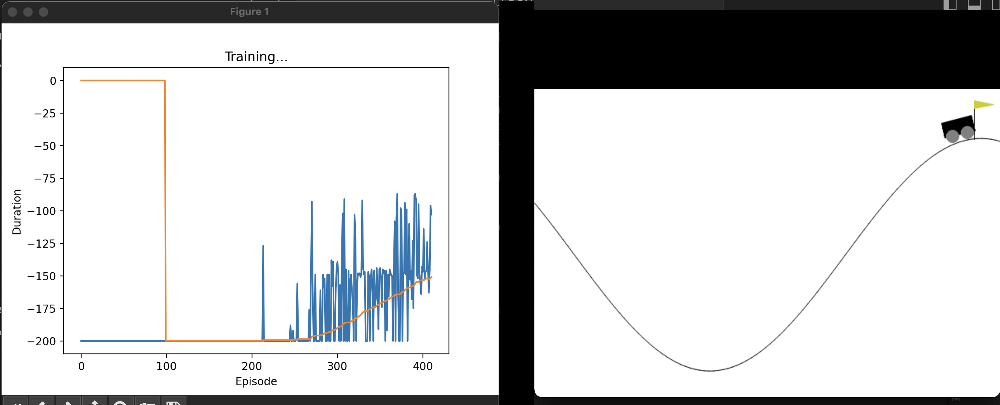

# DRL-Games

This repository contains implementations of Deep Reinforcement Learning (DRL) algorithms to solve classic games in the OpenAI Gym environment. 
## Contents

- **CartPole Problem**: Implementation of the Deep Q-Learning algorithm based on the seminal paper by Mnih et al.
- **MountainCar Problem**: Attempts to solve the MountainCar problem using DQN and HER. The DQN algorithm alone was insufficient, so HER was implemented to improve performance.

## CartPole Problem

The CartPole problem is a classic control problem where the goal is to balance a pole on a cart by applying a force of +1 or -1 to the cart. This repository implements the Deep Q-Learning algorithm to solve this problem.

### Implementation Details

- **Algorithm**: Deep Q-Learning
- **Environment**: `CartPole-v1`
- **Reference Paper**: Mnih, V., Kavukcuoglu, K., Silver, D., Rusu, A. A., Veness, J., Bellemare, M. G., ... & Hassabis, D. (2015). Human-level control through deep reinforcement learning. *Nature*, 518(7540), 529-533.

## MountainCar Problem

The MountainCar problem involves driving a car up a steep hill. The car's engine is not strong enough to directly climb the hill, so the agent must learn to leverage potential energy by driving back and forth.

### Implementation Details

- **Algorithm**: Hindsight Experience Replay (HER) + DQN
- **Environment**: `MountainCar-v0`
- **HER Goals**: Position and velocity of the car
- **Reference Paper**: Andrychowicz, M., Wolski, F., Ray, A., Schneider, J., Fong, R., Welinder, P., McGrew, B., Tobin, J., Abbeel, P., & Zaremba, W. (2017). Hindsight Experience Replay. ArXiv. /abs/1707.01495

## Breakout Atari Game - DQN
After 1000 games

https://github.com/user-attachments/assets/ee76a21c-17ce-4863-aedc-b82e6d88a641

After 4000 games

https://github.com/user-attachments/assets/43916d49-be90-4594-a671-2ee4b05e7810

Result 

